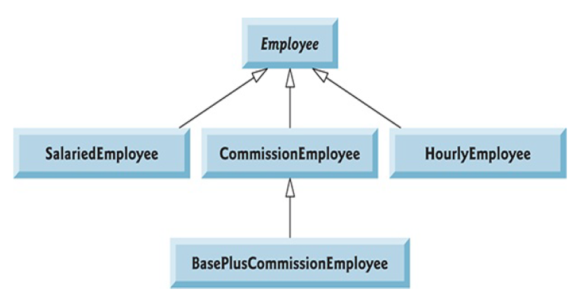

# Example 1: Polymorphism-abstraction

A company pays its employees on a weekly basis. The
employees are of four types: SalariedEmployee are paid a
fixed weekly salary regardless of the number of hours worked,
HourlyEmployee are paid by the hour and receive overtime
pay (i.e., 1.5 times their hourly salary rate) for all hours
worked in excess of 40 hours, CommissionEmployee are paid
a percentage of their sales and BaseSalariedCommissionEmployee
receive a base salary plus a percentage of their
sales. For the current pay period, the company has decided to
reward BaseSalariedCommissionEmployee by adding 10% to
their base salaries. The company wants you to write an
application that performs its payroll calculations (Main)
polymorphically

